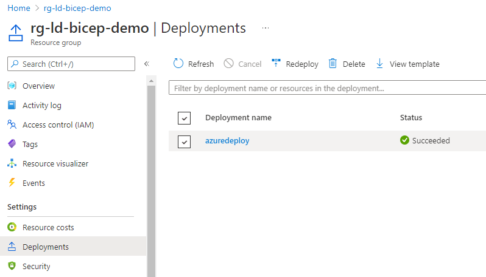
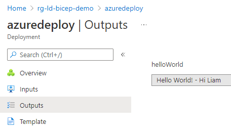

# 01--world

This demo is a simple "Hello, World!" example. We initially setup the files to deploy using the traditional ARM method, and then convert them to their Bicep equivalent.

## Steps

1. Update `arm/azuredeploy.parameters.jsonc` and set the yourName parameter.
2. Update `arm/deploy.ps1` and provide a resource group name that you have permissions to deploy to.

> If you don't have a resource group already you can use the `az group create` command to create an empty one.

3. From your PowerShell terminal execute the above deploy.ps1 script.
4. Assuming deployment ran successfully, navigate to the resource group you provided in Azure and head to the deployment log to review.

5. From your PowerShell terminal execute `./convert.ps1`. This will convert the existing ARM files into their Bicep equivalents and update the deployment scripts.
6. From your PowerShell terminal execute the `bicep/deploy.ps1` script.
7. Repeat step 4 and review the deployment log to ensure everything has run successfully.

Congratulations, you have now deployed your first Bicep script! Take a look at the differences between the primary ARM and Bicep files to see how the syntax differs between the two while achieving the same end result.